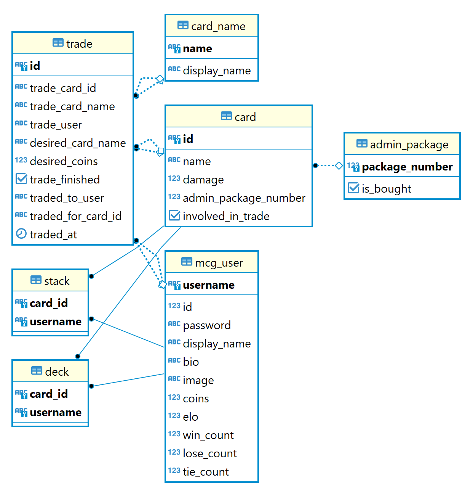

# Protokoll

Im folgenden Abschnitt gehe ich ein wenig auf die Implementierung des Spiels ein und die Herausforderungen die sich mir
in dieser Zeit gestellt haben.

Insgesamt habe ich mehr als 100 Stunden gebraucht das Spiel zu entwickeln und fertigzustellen.

## Card Specialities

- Dark Bat
    - (+) SlownessSpell
- Dark Ent
    - (+) Orc, Knight
- Dragon
    - (+) GreyGoblin
    - (-) FireElf
- FireElf
    - (+) Dragon
- FireWizard
    - (+) Orc
    - (-) WaterWitch
- Grey Goblin
    - (-) Dragon
- Knight
    - (-) WaterSpell, DarkEnt
- Kraken
    - (+) SpellCard
- Orc
    - (-) FireWizard, DarkEnt
- WaterWitch
    - (+) SpellCard, FireWizard
- **All Spells:**
    - **(-) Kraken, WaterWitch**
- SlownessSpell
    - (-) DarkBat
- WaterSpell
    - (+) Knight

## Implementierung

Begonnen habe ich mit der Implementierung/Erstellung der Card Klassen. Dabei habe ich zuerst eine abstrakte Base Klasse
(`CardBase`) erstellt mit den Attributen die bei allen Karten gleich sind. Danach habe ich jeweils für die Arten der
Karten eine Subklasse erstellt, ebenfalls abstrakt. Eine Klasse `SpellCard` und eine Klasse `MonsterCard`. Die
Kampflogik schlängelt sich durch beide Klassen durch. Die Basislogik ist in der `CardBase` Klasse implementiert und bei
gewissen "specialities" (`Knight` drowns when hit with `WaterSpell`, usw...) wurde die `attack` Methode in den
jeweiligen Klassen überschrieben und dementsprechend adaptiert.

Dann habe ich zu dieser `attack` Methode einige Tests geschrieben, um die Funktionalität zu überprüfen.

Anschließend habe ich eine `CardFactory` erstellt die das Instanziierung der Card Objekte übernimmt. Diese Funktion habe
ich in der `Package` Klasse dann verwendet um zufällig in Abhängigkeit von der Seltenheit der Karte (see `CardsEnum`
and `RarityEnum`) 5 Karten zu generieren.

Weiters habe ich alle Grundklasse erstellt wie zum Beispiel `Deck, Stack, Trade` sowie die  `User` Klasse erstellt.

Als Nächstes habe ich den Server aufgesetzt. Dazu habe ich eine `Server` klasse erstellt die mittels
eines `ServerSockets` auf neue Verbindungen lauscht. Sobald eine Verbindung etabliert werden konnte habe ich den durch
die Verbindung erstellten "Client"-`Socket` an die Worker Klasse `ClientGameRunner` weitergegeben. Das ist notwendig um
eine mehrere Verbindungen mit einem Server gleichzeitig zu erstellen, denn wenn der `Server` sich um die Anfragen des
soeben verbundenen Clients kümmern müsste, könnte er nicht gleichzeitig nach neuen Verbindungen "offen" sein.

Für alle Funktionen bzw. "URL Paths" habe ich einen Controller erstellt. Jeder Controller erbt von der
abstrakten `ControllerBase` Klasse, welche die Methode `doWorkIntern` vorgibt. Im `ClientGameRunner` wird dann der
jeweilige Controller abhängig von dem Path ausgewählt und die `doWork` Methode vom `ControllerBase` aufgerufen. In
dieser Methode wird eine Postgresql Transaction gestartet und nach dem erfolgreichen Ausführen der `doWorkIntern`
Methode (aus der jeweiligen Implementierung) alle Änderungen committed. Im Fall das ein Fehler auftritt und aufgefangen
wird, wird ein Rollback durchgeführt welcher den Stand der Datenbank wieder auf den vor Beginn der Transaction
zurücksetzt. Dies ist sehr hilfreich um nicht den Fehler zu begehen bei einer Exception/Fehler relativ weit
vorgeschritten in einem Bearbeitungsprozess einer Funktion, wie z.B. dem Tauschen von Karten, abzubrechen und
gleichzeitig die ersten Änderungen bereits in der Datenbank zu persistieren. Wenn dann sozusagen die ganze Funktion
fehlerfrei abläuft, wird schlussendlich am Ende der `doWork` methode die Transaktion beendet und alle Änderungen in die
Datenbank geschrieben.

### URL Paths and corresponding Controllers:

- "users" -> `AddAndEditUserController`
- "battles" -> `BattleController`
- "sessions" -> `LoginUserController`
- "packages", "translations" -> `PackageController`
- "cards" -> `StackController`
- "deck" -> `DeckController`
- "stats" -> `UserStatController`
- "score" -> `ScoreboardController`
- "tradings" -> `TradeController`

Dann habe ich eine postgresql Datenbank in einem Docker image aufgesetzt.

Über die Repository Klassen (Base class: `RepositoryBase`) greife ich auf die Datenbank zu und lese oder schreibe
mittels PreparedStatements darauf. Die PreparedStatements verhindern das durch User input eine SQL injection zustande
kommt. Um die Benutzung der Repositories zu erleichtern, habe ich die Klasse `RepositoryHelper` erstellt, die jeweils
alle Repository beinhaltet und für jeden `ClientGameRunner` erstellt wird und jeweils an alle Controllern weitergegeben
wird. Somit hat man alle Repos gebündelt und kann sich über getter das jeweils gerade benötigte holen.

Zu Beginn jeder Operation in einem Controller wird in der `doWorkIntern` methode als all erstes die
Datenbank `Connection` gesetzt und am Ende der Methode geschlossen.

Nach mehreren Versuchen die Kampflogik effizienter zu machen bin ich auf folgende Lösung gekommen:

Für den Kampf habe ich eigens einen Handler (`BattleQueueHandler`) geschrieben. Dieser agiert mehr oder weniger als eine
Queue für die User. Wenn eine Battle Anfrage zum Server kommt, wird diese mittels des `BattleControllers` an
den `BattleQueueHandler`
weitergegeben, der sofort ein `CompletableFuture<Response>` zurückgeliefert welches dann ein Result liefert, wenn das
Battle dieses Users abgearbeitet wurde. Der `BattleQueueHandler` checkt ständig, ob gerade zwei User in der Queue sind
und verknüpft diese miteinander und lässt diese kämpfen. Sobald der Kampf zwischen zwei Usern gestartet wird, werden
beide aus der "Queue" entfernt. Am Ende des Kampfes wird die `CompletableFuture`, die bereits an den
jeweiligen `BattleController` des `ClientGameRunner` returned wurde, completed und die Response kann dann an den User
geschickt werden.

### ER Database Diagram

Bei der Datenbank habe ich geschaut, dass ich so gut wie nur die Sachen persistiere, die auch notwendig sind. Z.B. habe
ich eine eigene Tabelle `admin_pakage` erstellt in denen lediglich die `package_number` und eine `is_bought` Flag
gespeichert werden. In der `card` Tabelle wird dann, falls eine Card einem Admin Package zugeordnet wird
die `package_number` dran gehängt.

### Testing

Getestet habe ich das ganze mittels Unit tests. Jeder Controller hat eine eigene Klasse in die einzelnen Fälle überprüft
und getestet werden. Dabei werden die in der jeweiligen Klasse benutzten Repositories mittels des Mockito
Framework (`@Mock`) gemockt. Das bedeutet nichts weiter als, dass man für eine Methode einen bestimmten Rückgabewert
definiert der im Falle, wenn die jeweilige Methode ausgeführt wird, zurück gegebene wird.

Bei den Unit tests bin ich so vorgegangen, dass ich jeweils eine Methode mit mehreren assertions überprüft habe und
davor oder in der `setUp` methode mittels des "when thenReturn" Prinzips die Mock Objekte gesetzt habe.

Auch einen Integrationstest habe ich geschrieben der den laufenden Server mit normalen HTTP Anfragen testet und somit
wie ein echter User die Software benutzt. Der einzige Nachteil daran ist, dass dadurch Daten in der Datenbank verändert
werden, was bei den Unit tests nicht der Fall ist.

### Unique features

Als unique feature habe ich einerseits weitere Monster- und Spellkarten erstellt, andererseits denen Karten auch eine
Seltenheit ("Rarity") versehen die bei dem Kauf eines Random Packages eine Rolle spielen. Ebenso habe ich die Schwächen
und Stärken der Monster als Beschreibung dieser gewählt damit Ergebnisse leichter nachvollzogen werden können. Wie sich
daraus schon schließen lässt gibt es zwei Möglichkeiten Packages zu kaufen. Entweder vom Admin vordefinierte, oder vom
Zufall erstellte Packs.

Weiters habe ich die Möglichkeit eingebaut bei einem Tausch Karten nur gegen Coins oder gegen eine andere Karte und
Coins zu tauschen. Trades können nach username oder nach der "bereits abgeschlossen" Flag gefiltert werden, um die
Übersicht zu verbessern. Es ist ebenso möglich sich seinen Tauschverlauf auszugeben.

Auch habe ich einige weitere URL Parameter für spezielle Rückgabe einiger Datensätze hinzugefügt. Einerseits beim Stack,
das nur Cards zurückgegeben werden die wahlweise nicht im deck oder auch nicht in einem Trade verwickelt sind. Auch beim
Package gibt es ja die Möglichkeit zwischen Admin Package und Random Packages zu wählen, jeweils wieder mit URL
Parametern.

## Lessons Learned

Ich habe aus diesem Projekt vor allem einiges beim Testschreiben dazugelernt. In der Vergangenheit habe ich zwar schon
mit JUnit getestet aber ich bin im Laufe der Testentwicklung auf verschiedene neue Möglichkeiten gekommen, von denen ich
davor noch nichts wusste. Ich habe vor dem MCG noch nie eine Datenbank über Docker laufen lassen, was auch eine sehr
tolle Erfahrung war. Ich musste auch auf die harte Tour lernen, dass man code viel mehr abstrahieren sollte, um Code zu
sparen und nicht öfters den gleichen Code schreiben zu müssen. Ich habe mehrmals im Laufe des Projekts größere
Änderungen an der Struktur des Projekts machen müssen, da ich z.B. eine weitere Abstraktionsebene hinzugefügt habe.

Ich habe auch eine Zeit lang gebraucht um mit SQL transactions zu arbeiten, die mir das händische testen enorm
erleichterten.

Ebenso habe ich viel Zeit damit verbracht bessere Lösungen für fertige Funktionen zu suchen, das war beispielsweise bei
der Queue für das Battle.